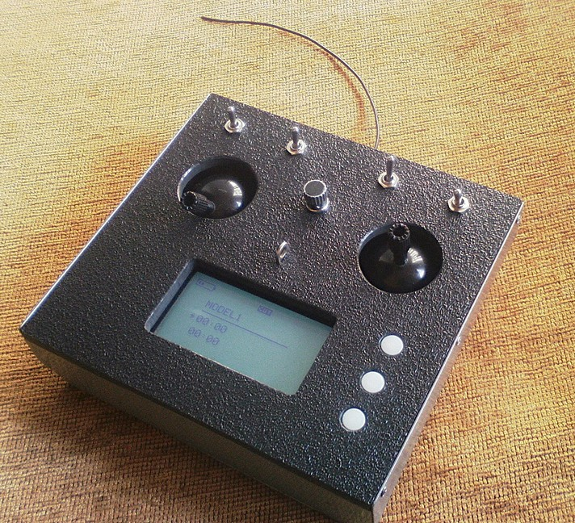
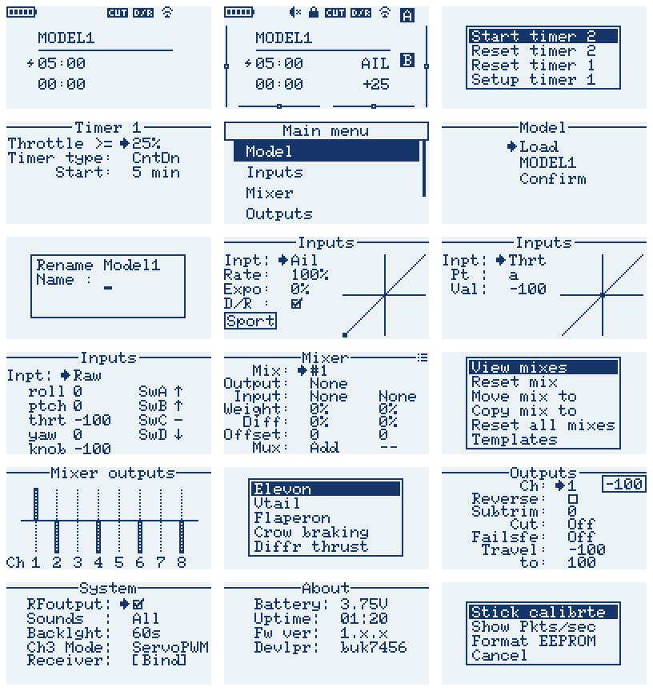

# Arduino Lora based RC system

## Features
- 8 proportional channels and 2 digital channels
- Reverse, subrim, Endpoints, Failsafe
- Dual rates and expo for Ail, Ele, Rud
- Throttle curve and a custom curve with 5 points
- Flexible mixer with 10 mixer slots per model
- Adaptable timer plus a stopwatch
- 5 model memory
- Sticks calibration
- Audio tones
- Receiver binding
- Frequency hopping 

## License
MIT license

## Hardware
#### Transmitter
- 2x Atmega328p microcontrollers
- 1x Semtech SX1276/77/78/79 based rf module 
- 128x64 KS0108 based LCD, or any 128x64 lcd (provide own driver code).
- 2x Joysticks, 3x two position switches, 1x three position switch, 1x potentiometer
- 3x push buttons
- Additional support components

#### Receiver
- 1x Atmega328p mcu
- 1x Semtech SX1276/77/78/79 based rf module
- Additional support components

The schematics can be found in the 'etc' folder under root directory

## Compiling
The code compiles on Arduino IDE 1.8.x or higher with board set to Arduino Uno. 
 The transmitter code is in mtx (master mcu) and stx (slave mcu) folders. The receiver mcu code is in 
the rx folder. No external libraries are required to compile.
 I am using the 433MHz band with the SX1278 modules. If using other modules or frequency band, it is 
neccessary to edit the frequency lists in the stx.ino and rx.ino files. 

## User Interface
- Three buttons are used for navigation; Up, Select, Down. Long press Select to go Back. 
- Holding the Down key on home screen accesses the extra digital channels A and B.
- Holding the Select key on home screen accesses the trims.
- Holding the Select key while powering opens the boot menu (for stick recalibration, format eeprom, etc.)

## Binding
To bind the receiver and transmitter, use the bind option in the receiver setup screen. 
Select bind option and restart the receiver. The LED in receiver blinks on successful bind.

## Mixing
This controller implements a free mixer that offers flexiblity with what we want to control. 
Each mixer slot takes two inputs, multiplexes them, and sends the result to the specified output. 
Available multiplex options are Add, Multiply, Replace. We can also assign a switch to turn the mix on or off.
Mixer slots are evaluated sequentially. 
 
  Mixer sources can be any of the following
- Raw stick inputs (roll, pitch, thrt, yaw, knob)
- Constants (max)
- Switches (SwA, SwB, SwC, SwD)
- Slowed input (appears with an asterisk)
- Curves (Ail, Ele, Thrt, Rud, Cv1)
- Channels (Ch1 to Ch8)
- Temporary variables (Virt1, Virt2)

The default mapping is Ail->Ch1, Ele->Ch2, Thrt->Ch3, Rud->Ch4, unless overridden in the mixer.

##### [Example mixes](mixer.md)

## Testing
I have done several tests on this system and found it reliable enough. 
 The range I got with the SX1278 modules (433MHz at BW 250kHz, SF7, CR 4/5, 17dBm tx power, monopole antennas) was more than 2km line of sight in a semi urban area.
 I have also tested the frequency hopping feature and it is stable enough. 
 The transmitter to receiver update rate is about 40 frames a second which is sufficient to control an RC model. 
There are no issues experienced with the servo control either. 

## Limitations
1. No basic telemetry support. 
2. No dedicated trim buttons. However we can access trim from the home screen by holding the select key.
